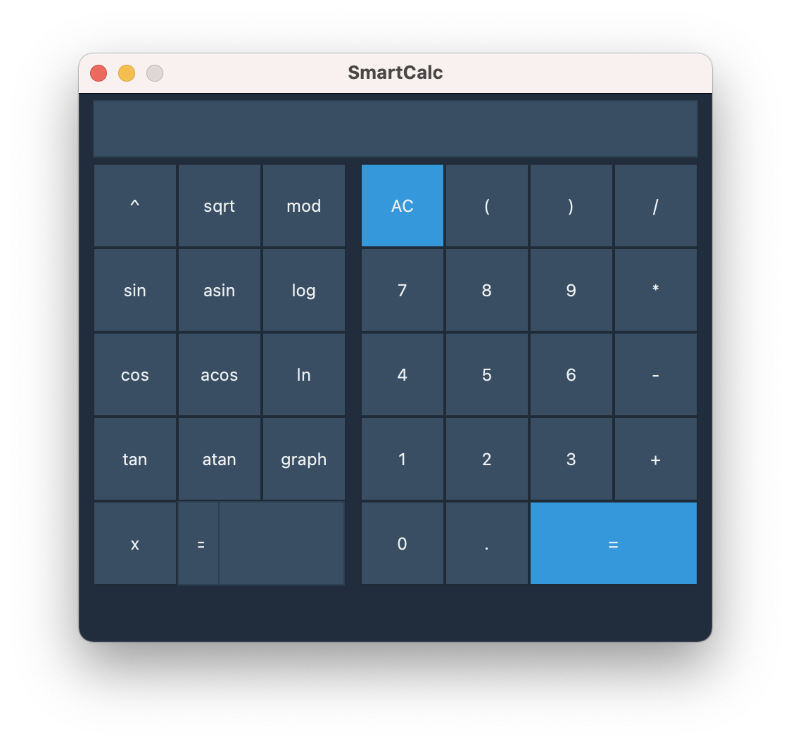
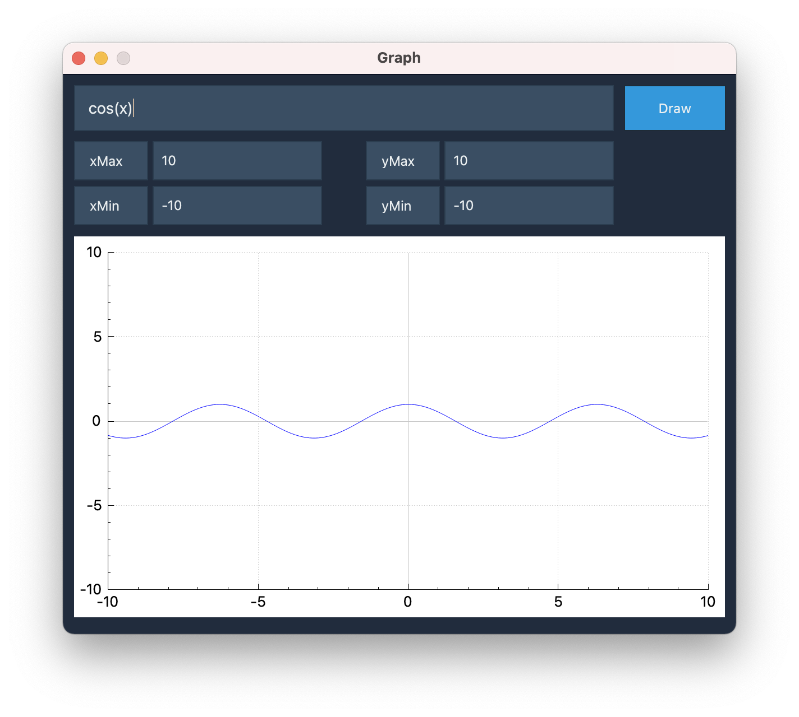
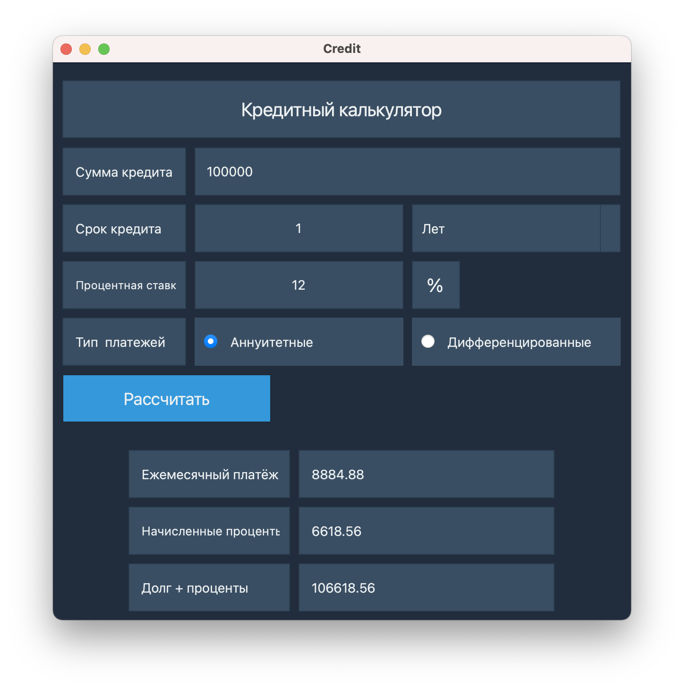
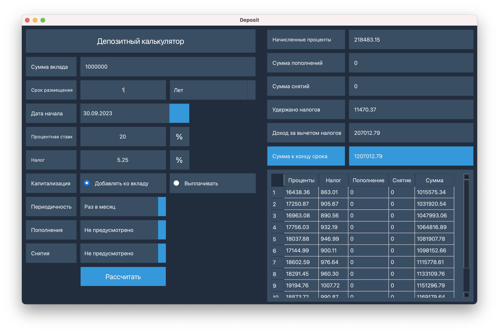

# Calculator
В данном проекте реализована расширенная версия обычного калькулятора. Помимо базовых арифметических операций, как плюс-минус и умножить-поделить, калькулятор обладает возможностью вычисления арифметических выражений с учетом приоритетов, а так же некоторыми математическими функциями (синус, косинус, логарифм и т.д.). Помимо вычисления выражений калькулятор поддерживает использование переменной x и построение графика соответствующей функции. В качестве дополнительных улучшений добавлены кредитный и депозитный калькуляторы.

